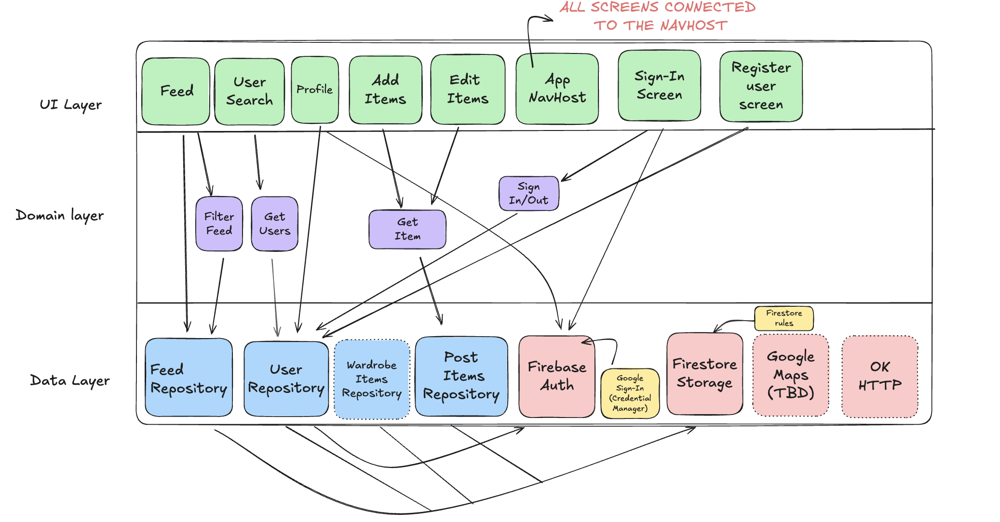

[](https://sonarcloud.io/summary/new_code?id=swent-Team01_OOTD)
[](https://sonarcloud.io/summary/new_code?id=swent-Team01_OOTD)

# OOTD 

## Description
People often have trouble finding easily accessible and up-to-date inspiration for their outfits. 
Style-conscious people and fashion enthusiasts need a place to share their outfit ideas, get 
feedback and find inspiration in others. Our app aims to enable users to be able to share their 
outfit of the day with their friends to inspire them and give new style ideas while also suggesting 
brands to buy viewed items from making it easy to replicate outfits that appear in your feed. Users 
are also able to store their previous outfits and highlight ones that they like best.

## App Architecture
The app follows the MVVM (Model-View-ViewModel) architecture pattern, which separates the user 
interface from the business logic and data handling. This architecture enhances code maintainability,
testability, and scalability. Below is a brief diagram of the architecture, more details can be 
found in our project wiki. The full Excalidraw file is available in the diagrams folder of the repository.


## Installation

### Clone the Repository
```bash
git clone https://github.com/swent-Team01/OOTD.git
cd OOTD
```

## Project Setup

### System Requirements
- **Java Version**: JDK 17
- **Gradle Version**: 8.13.0
- **Android Version**: Android 15 (API level 35)
- **Target SDK**: 35

## Running the Project

### Local Development
1. **Open the project in Android Studio**
2. **Sync the project** (Using Gradle sync)
3. **Run the app**:
   - Select an emulator or connect a physical device
   - Click the "Run" button

### Command Line Build
```bash
# Build the project
./gradlew build

# Run unit tests
./gradlew test

# Generate code coverage report
./gradlew jacocoTestReport

# Check code formatting
./gradlew ktfmtCheck
```

## Pull Request Guidelines

### Before Submitting a PR

1. **Create a feature branch** from `main` following naming conventions:
   [Github Wiki](https://github.com/swent-Team01/OOTD/wiki/Branching-guidelines)
  
2. **Ensure code quality**:
   - Run `./gradlew ktfmtCheck` to verify code formatting
   - Run `./gradlew test` to ensure all unit tests pass
   - Run `./gradlew connectedAndroidTest` for integration tests
   - Maintain or improve code coverage (minimum 80%)

### PR Description Template
- [Github Wiki for PR template](https://github.com/swent-Team01/OOTD/wiki/Process-Definition#commit-message-template-conventional-commits)

## Ressources :
- [SonarCloud](https://sonarcloud.io/organizations/swent-team01/projects)
- [GitHub](https://github.com/swent-Team01/OOTD)
- [GitHub Wiki](https://github.com/swent-Team01/OOTD/wiki)
- [Figma](https://www.figma.com/design/EQfCuEx3jJpUSZ3NKc4DE5/stefan.taga-s-team-library?t=1rG02nxGubCxY31q-0)

## Our Team
| Name                 | GitHub account                                   |
|----------------------|--------------------------------------------------|
| Kallergis Marc       | [@MarcK0909](https://github.com/MarcK0909)       |
| Steinhauser Corentin | [@cocoStein](https://github.com/cocoStein)       |
| Möbius  Clemens      | [@Clemensito](https://github.com/Clemensito)     |
| Taga    Stefan       | [@stefantaga24](https://github.com/stefantaga24) |
| Meric  Julien        | [@j-meric](https://github.com/j-meric)           |
| Pitu  Bianca         | [@bbianca2004](https://github.com/bbianca2004)   |
| Ünlüer Aslı          | [@asunluer](https://github.com/asunluer)         |
