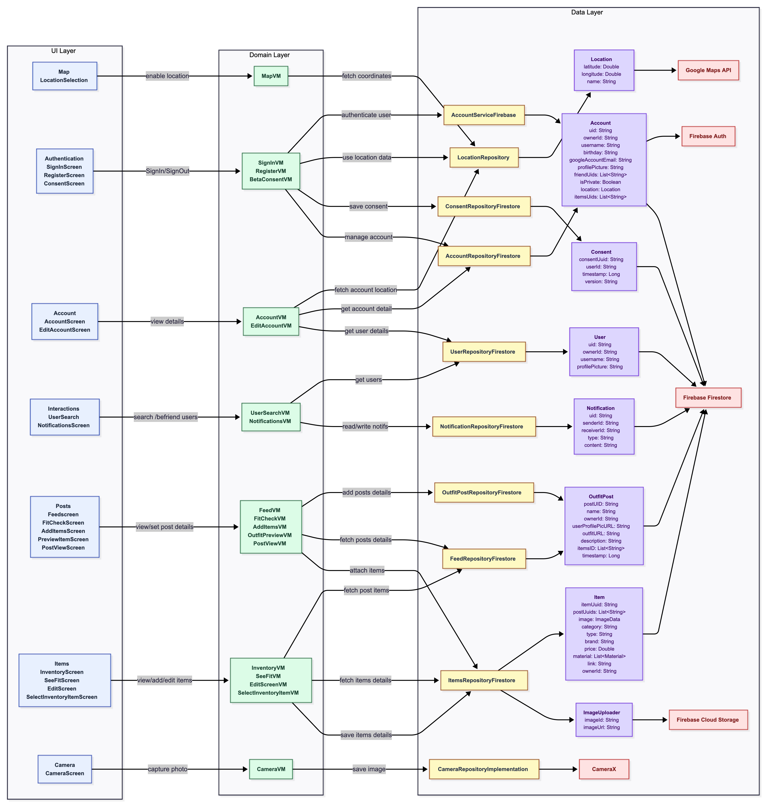

<div align="center">

# 👗 OOTD - Outfit Of The Day

**Your Daily Fashion Inspiration & Styling Companion**

[](https://sonarcloud.io/summary/new_code?id=swent-Team01_OOTD)
[](https://sonarcloud.io/summary/new_code?id=swent-Team01_OOTD)
[](https://github.com/swent-Team01/OOTD/actions)
[](https://kotlinlang.org)
[](https://developer.android.com)

[Features](#-features) • [Installation](#-installation) • [Usage](#-usage) • [Contributing](#-contributing)

</div>

---

## About

**OOTD** is a social fashion platform that helps style-conscious individuals and fashion enthusiasts discover, share, and curate their daily outfits. Whether you're looking for inspiration, want to showcase your style, or need feedback from your fashion-forward friends, OOTD makes it easy and fun.

### The Problem We Solve

People often struggle to find accessible, up-to-date outfit inspiration. They want to:
- **Share** their creative outfit combinations
- **Discover** what others are wearing
- **Get feedback** from their style community
- **Shop** the looks they love

### Our Solution

OOTD provides a dedicated social platform where users can:
- Post their daily outfits with tagged items
- Build a personal wardrobe inventory
- Follow friends and fashion influencers
- Discover outfit inspiration from their feed
- Find shopping links for items they admire
- Save and highlight their favorite looks

---

## Features

### User Management
- **Google Sign-In**: Quick and secure authentication
- **User Profiles**: Customizable profiles with bio and profile pictures
- **Friend System**: Follow, unfollow, and manage your fashion network
- **Privacy Controls**: Manage who can see your content

### Outfit Posts
- **Camera Integration**: Capture your OOTD directly in-app
- **Photo Upload**: Share outfits from your gallery
- **Item Tagging**: Tag clothing items with details and shopping links
- **Captions & Descriptions**: Add context to your outfit posts
- **Likes & Comments**: Engage with the community

### Wardrobe Management
- **Personal Inventory**: Catalog all your clothing items
- **Item Details**: Track brand, price, category, and purchase location
- **Visual Organization**: Browse your wardrobe at a glance
- **Quick Access**: Easily tag items from your inventory in posts

### Social Feed
- **Personalized Timeline**: See posts from friends you follow
- **Discovery**: Explore trending outfits and new styles
- **Real-time Updates**: Stay up-to-date with your fashion community
- **Notifications**: Get notified of likes, comments, and new followers

### Location Features
- **Store Finder**: Discover where items were purchased
- **Google Maps Integration**: Navigate to nearby shopping locations
- **Location Tagging**: Share where you bought your favorite pieces

### Smart Notifications
- **Push Notifications**: Stay informed of social interactions
- **Follow Requests**: Accept or decline new followers
- **Activity Updates**: Never miss a comment or like on your posts

### User Experience
- **Modern UI**: Clean, intuitive Material Design 3 interface
- **Dark/Light Mode**: Choose your preferred theme
- **Smooth Animations**: Polished transitions and interactions
- **Offline Support**: Access your wardrobe even without internet

---

## Architecture

OOTD follows the **MVVM (Model-View-ViewModel)** architecture pattern, ensuring clean separation of concerns:

- **Model**: Data layer with repositories (Firestore, Firebase Storage)
- **View**: Jetpack Compose UI components
- **ViewModel**: Business logic and state management

This architecture enhances code maintainability, testability, and scalability. For detailed architecture documentation, visit our [project wiki](https://github.com/swent-Team01/OOTD/wiki).

<div align="center">



*Architecture Diagram - See `/diagrams` folder for source files*

</div>

### Tech Stack

**Core Technologies**
- **Language**: Kotlin 2.1.10
- **UI Framework**: Jetpack Compose (Material 3)
- **Build System**: Gradle 8.13.0
- **Min SDK**: Android 9 (API 28)
- **Target SDK**: Android 15 (API 35)

**Firebase Services**
- **Authentication**: Firebase Auth with Google Sign-In
- **Database**: Cloud Firestore
- **Storage**: Firebase Cloud Storage
- **Analytics**: Firebase Analytics (optional)

**Key Libraries**
- **Navigation**: Jetpack Navigation Compose (v2.8.5)
- **Image Loading**: Coil (v2.7.0)
- **Maps**: Google Maps Compose (v4.3.3)
- **Camera**: CameraX (v1.5.1)
- **Async**: Kotlin Coroutines & Flow
- **DI**: Manual dependency injection
- **Testing**: JUnit, Mockito, MockK, Kaspresso, Robolectric

**CI/CD & Quality**
- **CI**: GitHub Actions (on Blacksmith runners)
- **Code Quality**: SonarCloud
- **Code Formatting**: ktfmt
- **Test Coverage**: JaCoCo (80%+ coverage target)

---

## Installation

### Prerequisites

Before you begin, ensure you have the following installed:

- **Android Studio**: Hedgehog (2023.1.1) or newer
- **JDK**: Version 17 or higher
- **Android SDK**: API 28-35
- **Git**: For cloning the repository

### Step 1: Clone the Repository

```bash
git clone https://github.com/swent-Team01/OOTD.git
cd OOTD
```

### Step 2: Configure Firebase

1. Create a Firebase project at [Firebase Console](https://console.firebase.google.com/)
2. Add an Android app with package name: `com.android.ootd`
3. Download the `google-services.json` file
4. Place it in the `app/` directory

> **Note**: For contributors, the `google-services.json` is automatically injected during CI builds via secrets.

### Step 3: Set Up Google Maps API

1. Get a Google Maps API key from [Google Cloud Console](https://console.cloud.google.com/)
2. Enable the following APIs:
   - Maps SDK for Android
   - Places API (if using place search features)
3. Create a `local.properties` file in the project root (if it doesn't exist)
4. Add your API key:

```properties
MAPS_API_KEY=your_google_maps_api_key_here
```

> **Security Note**: Never commit `local.properties` to version control. It's already in `.gitignore`.

### Step 4: Build the Project

#### Using Android Studio

1. Open the project in Android Studio
2. Wait for Gradle sync to complete
3. Select a device or emulator
4. Click the **Run** button (▶️) or press `Shift + F10`

#### Using Command Line

```bash
# Grant execute permission (first time only)
chmod +x ./gradlew

# Build the debug APK
./gradlew assembleDebug

# Install on connected device
./gradlew installDebug
```

### Step 5: Run Tests

```bash
# Run unit tests
./gradlew test

# Run instrumented tests (requires emulator/device)
./gradlew connectedAndroidTest

# Generate coverage report
./gradlew jacocoTestReport

# Check code formatting
./gradlew ktfmtCheck
```

### Troubleshooting

**Build Errors**

<details>
<summary>❌ "google-services.json not found"</summary>

**Solution**: Ensure you've placed the `google-services.json` file in the `app/` directory. See [Step 2: Configure Firebase](#step-2-configure-firebase).
</details>

<details>
<summary>❌ "MAPS_API_KEY not set"</summary>

**Solution**: Add your Google Maps API key to `local.properties`:
```properties
MAPS_API_KEY=your_api_key_here
```
See [Step 3: Set Up Google Maps API](#step-3-set-up-google-maps-api) for details.
</details>

<details>
<summary>❌ Gradle sync fails</summary>

**Solutions**:
1. Ensure you're using JDK 17 or higher
2. Clear Gradle cache: `./gradlew clean`
3. Invalidate caches in Android Studio: `File > Invalidate Caches / Restart`
4. Delete `.gradle` and `.idea` folders, then sync again
</details>

**Runtime Issues**

<details>
<summary>❌ Authentication fails</summary>

**Solutions**:
1. Verify your SHA-1 fingerprint is added in Firebase Console
2. Check that `google-services.json` is up to date
3. Ensure package name matches: `com.android.ootd`
4. Try clearing app data and signing in again
</details>

<details>
<summary>❌ Maps not loading</summary>

**Solutions**:
1. Verify your Maps API key is valid and has the correct APIs enabled
2. Check that billing is enabled for your Google Cloud project
3. Ensure the device has internet connectivity
4. Verify location permissions are granted
</details>

<details>
<summary>❌ Images not uploading</summary>

**Solutions**:
1. Check Firebase Storage rules are configured correctly
2. Ensure internet connectivity
3. Verify camera and storage permissions are granted
4. Check Firebase Storage quota hasn't been exceeded
</details>

**Testing Issues**

<details>
<summary>❌ Tests fail with "Unable to resolve dependency"</summary>

**Solution**: Run `./gradlew --refresh-dependencies` to refresh dependencies.
</details>

<details>
<summary>❌ Instrumented tests fail to run</summary>

**Solutions**:
1. Ensure an emulator or device is connected: `adb devices`
2. Clear app data: `./gradlew uninstallAll`
3. Disable animations on the test device
</details>

---

## Usage

### First-Time Setup

1. Launch the app
2. Sign in with your Google account
3. Grant necessary permissions:
   - Camera (for taking outfit photos)
   - Location (optional, for store finder)
   - Notifications (to stay updated)
4. Complete your profile setup

### Key User Flows

**Posting an Outfit**
1. Tap the **+** button on the home screen
2. Take a photo or select from gallery
3. Tag items in your outfit
4. Add a caption and location (optional)
5. Share with your followers

**Building Your Wardrobe**
1. Navigate to **Wardrobe** tab
2. Tap **Add Item**
3. Upload item photo and fill in details
4. Save to your personal inventory

**Discovering Outfits**
1. Browse your **Feed** for inspiration
2. Like, comment, or save posts
3. Follow users whose style you admire
4. Explore tagged items to shop the look

---

## Contributing

We welcome contributions from the community! Whether you're fixing bugs, adding features, or improving documentation, your help is appreciated.

> **Read our full [Contributing Guide](CONTRIBUTING.md)** for detailed instructions.

### Getting Started

1. **Fork the repository** and clone your fork
2. **Create a feature branch** from `main`:
   ```bash
   git checkout -b feature/your-feature-name
   ```
3. **Make your changes** following our coding standards
4. **Test thoroughly** (see guidelines below)
5. **Submit a pull request** with a clear description

### Branch Naming Convention

Follow our [branching guidelines](https://github.com/swent-Team01/OOTD/wiki/Branching-guidelines):

- `feature/description` - New features
- `fix/description` - Bug fixes
- `refactor/description` - Code refactoring
- `docs/description` - Documentation updates
- `test/description` - Test additions/improvements

### Code Quality Checklist

Before submitting a PR, ensure:

✅ **Code Formatting**: `./gradlew ktfmtCheck` passes  
✅ **Unit Tests**: `./gradlew test` passes with 80%+ coverage  
✅ **Integration Tests**: `./gradlew connectedAndroidTest` passes  
✅ **No Linter Errors**: Code follows Kotlin conventions  
✅ **Documentation**: Update relevant docs if needed

### Commit Message Format

We follow [Conventional Commits](https://www.conventionalcommits.org/):

```
type(scope): subject

body (optional)

footer (optional)
```

**Types**: `feat`, `fix`, `docs`, `style`, `refactor`, `test`, `chore`

**Example**:
```
feat(wardrobe): add filter by category

Implemented category filtering in wardrobe view with 
Material 3 chip selector component.

Closes #123
```

### Pull Request Process

1. **Update the PR template** with all relevant information
2. **Link related issues** using keywords (Closes #123)
3. **Request review** from maintainers
4. **Address feedback** promptly
5. **Squash commits** if requested before merging

For more details, see our [Process Definition](https://github.com/swent-Team01/OOTD/wiki/Process-Definition).

---

## Bug Reports & Feature Requests

### Reporting Bugs

Found a bug? Help us fix it!

1. Check if the issue already exists in [Issues](https://github.com/swent-Team01/OOTD/issues)
2. If not, create a new issue with:
   - Clear, descriptive title
   - Steps to reproduce
   - Expected vs actual behavior
   - Screenshots/videos (if applicable)
   - Device info and Android version

### Requesting Features

Have an idea? We'd love to hear it!

1. Open a [Feature Request](https://github.com/swent-Team01/OOTD/issues/new)
2. Describe the feature and its benefits
3. Explain your use case
4. Include mockups or examples (optional)

---

## License

This project is currently **not licensed** for public use. All rights are reserved by the OOTD development team. 

> **Note**: This is an academic project developed as part of the SWENT course. If you plan to use this code, please contact the team for permission.

---

## Support & Contact

### Get Help

- **Documentation**: [GitHub Wiki](https://github.com/swent-Team01/OOTD/wiki)
- **Issues**: [Bug Tracker](https://github.com/swent-Team01/OOTD/issues)
- **Discussions**: [GitHub Discussions](https://github.com/swent-Team01/OOTD/discussions)

### Team Resources

- **GitHub Repository**: [swent-Team01/OOTD](https://github.com/swent-Team01/OOTD)
- **Documentation**: [GitHub Wiki](https://github.com/swent-Team01/OOTD/wiki)
- **Design System**: [Figma Designs](https://www.figma.com/design/EQfCuEx3jJpUSZ3NKc4DE5/stefan.taga-s-team-library?t=1rG02nxGubCxY31q-0)
- **Code Quality**: [SonarCloud Dashboard](https://sonarcloud.io/organizations/swent-team01/projects)
- **CI/CD**: [GitHub Actions](https://github.com/swent-Team01/OOTD/actions)

---

## Team

OOTD is developed and maintained by a dedicated team of software engineering students:

| Name | GitHub |
|------|--------|
| **Marc Kallergis** | [@MarcK0909](https://github.com/MarcK0909) |
| **Corentin Steinhauser** | [@cocoStein](https://github.com/cocoStein) |
| **Clemens Möbius** | [@Clemensito](https://github.com/Clemensito) |
| **Stefan Taga** | [@stefantaga24](https://github.com/stefantaga24) |
| **Julien Meric** | [@j-meric](https://github.com/j-meric) |
| **Bianca Pitu** | [@bbianca2004](https://github.com/bbianca2004) |
| **Aslı Ünlüer** | [@asunluer](https://github.com/asunluer) |

---

## Acknowledgments

### Sponsors

<div align="center">


**Thank you to [Blacksmith](https://www.blacksmith.sh) for providing faster CI runners!**

Blacksmith's powerful infrastructure helps us maintain high code quality with quick feedback loops.

</div>

### Built With

This project leverages incredible open-source tools and services:

- [Android](https://www.android.com/) - Mobile platform
- [Kotlin](https://kotlinlang.org/) - Programming language
- [Jetpack Compose](https://developer.android.com/jetpack/compose) - Modern UI toolkit
- [Firebase](https://firebase.google.com/) - Backend services
- [SonarCloud](https://sonarcloud.io/) - Code quality analysis
- [GitHub Actions](https://github.com/features/actions) - CI/CD automation

---

##  Additional Documentation

- **[Architecture Guide](https://github.com/swent-Team01/OOTD/wiki/Architecture)** - Deep dive into app structure
- **[API Documentation](https://github.com/swent-Team01/OOTD/wiki/API)** - Firebase integration details
- **[Testing Strategy](https://github.com/swent-Team01/OOTD/wiki/Testing)** - Our testing approach
- **[Style Guide](https://github.com/swent-Team01/OOTD/wiki/Style-Guide)** - Coding conventions

---

<div align="center">

**Made with ❤️ by the OOTD Team**

*A SWENT [CS-311](https://edu.epfl.ch/coursebook/en/the-software-enterprise-from-ideas-to-products-CS-311) 2025 Project*

[⬆ Back to Top](#-ootd---outfit-of-the-day)

</div>
